# Universal 2D Engine Toolkit — Master Index
## MonoGame + Arch ECS + Composed Libraries

[Get Started :material-rocket-launch:](./E/E1_architecture_overview.md){ .md-button .md-button--primary }
[Browse Reference :material-book-open-variant:](./R/R1_library_stack.md){ .md-button }

<div class="grid-cards" markdown>
<div class="card" markdown>
<span class="card-number">64</span>
<span class="card-label">Documents</span>
</div>
<div class="card" markdown>
<span class="card-number">51</span>
<span class="card-label">Step-by-step Guides</span>
</div>
<div class="card" markdown>
<span class="card-number">10+</span>
<span class="card-label">Libraries Covered</span>
</div>
<div class="card" markdown>
<span class="card-number">~1K</span>
<span class="card-label">Lines Custom Code</span>
</div>
</div>

---

## How This Knowledge Base Is Organized

This documentation follows a modified [Diátaxis framework](https://diataxis.fr/), the industry-standard structure used by Cloudflare, Gatsby, Canonical, and others. Every document falls into one of four categories:

| Category | Purpose | When to use |
|----------|---------|-------------|
| **Reference** | Facts, specs, quick lookup | While coding — "what's the API?", "what version?" |
| **Explanation** | Architecture decisions, rationale, workflow | Before coding — "why this approach?", "what are the tradeoffs?" |
| **Guide** | Step-by-step implementation instructions | During coding — "how do I build this?" |
| **Catalog** | Comprehensive maps of options/genres | During planning — "what does my game need?" |

Each document is **self-contained** (readable on its own) and **cross-referenced** (links to related docs). If a library dies or a decision changes, update only the affected doc — the rest stays valid.

---

## Document Map

### Reference (look things up while coding)
| Doc | What's In It |
|-----|-------------|
| [R1 — Library Stack & Install Commands](./R/R1_library_stack.md) | Every package, version, install command, tiered by importance |
| [R2 — Capability Matrix](./R/R2_capability_matrix.md) | One table: capability → provider → notes |
| [R3 — Project Structure](./R/R3_project_structure.md) | Folder layout, solution organization, platform targets |
| [R4 — Game Design Resources](./R/R4_game_design_resources.md) | GDC talks, books by tier, pattern wikis, YouTube channels, MonoGame community |

### Explanation (understand decisions and workflow)
| Doc | What's In It |
|-----|-------------|
| [E1 — Architecture Overview](./E/E1_architecture_overview.md) | Why composed libraries, why Arch-only ECS, the core philosophy |
| [E2 — Why Nez Was Dropped](./E/E2_nez_dropped.md) | The problem, feature audit, replacement map, migration path |
| [E3 — Engine Alternatives Evaluated](./E/E3_engine_alternatives.md) | Murder, FlatRedBall, Monofoxe — why none fit |
| [E4 — Solo Project Management](./E/E4_project_management.md) | Vertical slices, scope, version control, build automation, tech debt |
| [E5 — AI-Assisted Dev Workflow](./E/E5_ai_workflow.md) | Structuring code for AI, what AI is good/bad at, review checklist |
| [E6 — Game Design Fundamentals](./E/E6_game_design_fundamentals.md) | MDA framework, design pillars, player motivation, feedback loops, pacing, iteration, scope |
| [E7 — Emergent Puzzle Design](./E/E7_emergent_puzzle_design.md) | Emergent vs contrived, BotW chemistry engine, WFC, procedural generation, combinatorial mechanics |
| [E8 — MonoGameStudio Post-Mortem](./E/E8_monogamestudio_postmortem.md) | What was built (134 files), tech stack decisions, what worked/didn't, tool-building trap lesson, full file map |
| [E9 — Solo Dev Playbook](./E/E9_solo_dev_playbook.md) | AI+ECS synergies, realistic productivity data, AI art pipeline, goal hierarchy, Kanban, scope creep, case studies, decision journal, planning sessions |

### Guides (build things)
| Doc | What's In It |
|-----|-------------|
| [G1 — Custom Code Recipes](./G/G1_custom_code_recipes.md) | Scene manager, render layers, SpatialHash, tweening, transitions, pooling — all code |
| [G2 — Rendering & Graphics](./G/G2_rendering_and_graphics.md) | Render pipeline, post-processors, lighting, shaders, sprites |
| [G3 — Physics & Collision](./G/G3_physics_and_collision.md) | Aether, SpatialHash, collision shapes, Verlet, decision table |
| [G4 — AI Systems](./G/G4_ai_systems.md) | BrainAI, FSM, behavior trees, GOAP, utility AI, pathfinding |
| [G5 — UI Framework](./G/G5_ui_framework.md) | Gum setup, forms controls, layout, comparison with Myra |
| [G6 — Audio](./G/G6_audio.md) | MonoGame audio, FMOD via FmodForFoxes, when to upgrade |
| [G7 — Input Handling](./G/G7_input_handling.md) | Apos.Input, input buffering, multi-device support |
| [G8 — Content Pipeline](./G/G8_content_pipeline.md) | MGCB, Aseprite, Tiled maps, fonts, asset workflow |
| [G9 — Networking](./G/G9_networking.md) | LiteNetLib, rollback, client-server, bandwidth, prediction, fixed-point |
| [G10 — Custom Game Systems](./G/G10_custom_game_systems.md) | Inventory, dialogue, save/load, crafting, quests, buffs, procgen |
| [G11 — Programming Principles](./G/G11_programming_principles.md) | SOLID, DRY/KISS/YAGNI, composition over inheritance |
| [G12 — Design Patterns](./G/G12_design_patterns.md) | Observer, Command, State Machine, Strategy, Factory, Flyweight, Service Locator |
| [G13 — C# Performance](./G/G13_csharp_performance.md) | Zero-alloc, Span, ArrayPool, SIMD, GC pressure, memory management |
| [G14 — Data Structures](./G/G14_data_structures.md) | Ring buffers, priority queues, bit flags, spatial structure selection |
| [G15 — Game Loop](./G/G15_game_loop.md) | Fixed timestep, interpolation, culling, batching, mobile optimization |
| [G16 — Debugging](./G/G16_debugging.md) | Systematic debugging methodology, visual symptom diagnosis, MonoGame + Arch ECS debugging, ImGui tooling, structured logging, assertions, common pitfalls |
| [G17 — Testing](./G/G17_testing.md) | What to test, unit testing, integration testing via interfaces |
| [G18 — Game Programming Patterns](./G/G18_game_programming_patterns.md) | 20 patterns (Command, Observer, State, Component, Object Pool, etc.) with MonoGame/ECS architecture notes |
| [G19 — Display, Resolution & Viewports](./G/G19_display_resolution_viewports.md) | Virtual resolution, scaling strategies, pixel art, mobile displays, HiDPI, aspect ratio decision table |
| [G20 — Camera Systems](./G/G20_camera_systems.md) | Follow patterns, deadzone, smoothing, shake, zoom, limits, split screen, ECS integration |
| [G21 — Coordinate Systems & Transforms](./G/G21_coordinate_systems.md) | World/screen/viewport/local space, conversion chain, transform matrices, touch input |
| [G22 — Parallax & Depth Layers](./G/G22_parallax_depth_layers.md) | Parallax scrolling, scroll factors, infinite tiling, Y-sort, Z-index within layers |
| [G23 — Particles](./G/G23_particles.md) | Struct pool particles, ECS particles, blending modes, emitter patterns, effect recipes |
| [G24 — Window & Display Management](./G/G24_window_display_management.md) | GraphicsDeviceManager, fullscreen modes, resize, VSync, graphics profiles, iOS display |
| [G25 — Safe Areas & Adaptive Layout](./G/G25_safe_areas_adaptive_layout.md) | iOS notch/Dynamic Island, safe area insets, HUD anchoring, aspect ratio handling, testing |
| [G26 — Resource Loading & Caching](./G/G26_resource_loading_caching.md) | ContentManager caching, scoped loading, JSON data, fonts, atlases, loading screens, memory |
| [G27 — Shaders & Visual Effects](./G/G27_shaders_and_effects.md) | HLSL pipeline, fire, water, wind, earth, lightning, ice shaders, post-processing, performance |
| [G28 — 3/4 Top-Down Perspective](./G/G28_top_down_perspective.md) | Tile conventions, Y-sort rendering, collision shapes, depth layers, sprite proportions, MonoGame+Arch patterns |
| [G29 — Game Editor](./G/G29_game_editor.md) | Replicating Godot's 2D editor in MonoGame/C#, ImGui.NET docking, inspector, tilemap editor, scene serialization |
| [G30 — Game Feel Tooling](./G/G30_game_feel_tooling.md) | Data-driven feel profiles, ImGui tuning panel, visual overlays, ghost/replay, frame advance, curve visualizer, presets |
| [G31 — Animation & Sprite State Machines](./G/G31_animation_state_machines.md) | Aseprite + ECS animation, state machines, directional sprites, animation events, blend layers, hit flash |
| [G32 — Deployment & Platform Builds](./G/G32_deployment_platform_builds.md) | dotnet publish, Steam/itch.io, macOS notarization, iOS/Android signing, CI/CD, versioning |
| [G33 — Profiling & Optimization Workflow](./G/G33_profiling_optimization.md) | Frame budgets, .NET profiling tools, GC tracking, draw call analysis, ImGui profiler, bottleneck identification |
| [G34 — Localization & Internationalization](./G/G34_localization.md) | String externalization, FontStashSharp Unicode, RTL layout, Gum UI text, plural rules, testing |
| [G35 — Accessibility](./G/G35_accessibility.md) | Colorblind modes, input remapping, screen reader support, difficulty options, Gum UI accessibility |
| [G36 — Publishing & Distribution](./G/G36_publishing_distribution.md) | Steam, itch.io, App Store, marketing, wishlists, launch strategy, post-launch operations |
| [G37 — Tilemap Systems & Tiled Integration](./G/G37_tilemap_systems.md) | Tiled .tmx loading, tilemap rendering, autotiling (4/8-bit bitmask), tile collision, chunk streaming, animated tiles, isometric/hex tilemaps |
| [G38 — Scene & Game State Management](./G/G38_scene_management.md) | Scene architecture, scene manager with stack, game state FSM, transitions, ECS world per scene, loading screens, pause system, overlays |
| [G39 — 2D Lighting & Shadows](./G/G39_2d_lighting.md) | Lightmap rendering, point/spot lights, ambient light, 2D shadow casting, normal map lighting, light cookies, day/night integration |
| [G40 — Pathfinding](./G/G40_pathfinding.md) | A* with grid graphs, Jump Point Search, flow fields, HPA*, 2D navmesh, path smoothing, steering behaviors, BrainAI integration, ECS time-slicing |
| [G41 — Tweening & Easing](./G/G41_tweening.md) | 31 easing curves, pooled tween engine, sequences/groups, tween targets (float/Vector2/Color), ECS integration, common game uses |
| [G42 — Screen Transitions & Loading Screens](./G/G42_screen_transitions.md) | Fade, crossfade, wipe, circle iris, shader dissolve/pixelate, mask transitions, async loading with progress, transition presets |
| [G43 — Entity Prefabs & Blueprint System](./G/G43_entity_prefabs.md) | Data-driven entity templates, JSON blueprints, blueprint inheritance, entity factory, Tiled object spawning, spawn tables, prefab pooling |
| [G44 — Version Control for Game Dev](./G/G44_version_control.md) | Git for game dev, .gitignore for MonoGame, Git LFS, branching strategy, asset management, git bisect, recovery |
| [G45 — Cutscenes & Scripted Sequences](./G/G45_cutscenes.md) | Timeline system, cutscene actions, data-driven JSON cutscenes, camera/entity choreography, skip system, trigger zones, coroutine alternative |
| [G46 — Modding Support](./G/G46_modding_support.md) | Data-driven architecture, asset override system, mod loading pipeline, Lua scripting (MoonSharp), security sandboxing, Steam Workshop |
| [G47 — Achievements & Progression](./G/G47_achievements.md) | Event-driven achievements, cumulative/collection/challenge types, platform integration (Steam/Game Center), XP curves, statistics tracking |
| [G48 — Online Services](./G/G48_online_services.md) | Leaderboards, cloud saves, matchmaking, rich presence, analytics/telemetry, authentication, anti-cheat, offline fallback, platform abstraction |
| [G49 — Isometric Perspective](./G/G49_isometric.md) | 2:1 dimetric math, coordinate conversion, diamond/staggered layouts, depth sorting, mouse picking, elevation, isometric pathfinding, camera |
| [G50 — Hot Reload & Live Editing](./G/G50_hot_reload.md) | FileSystemWatcher, JSON/texture/shader/tilemap hot reload, hot reload manager, .NET hot reload limitations, ImGui live tuning |
| [G51 — Crash Reporting & Production Errors](./G/G51_crash_reporting.md) | Global exception handler, crash dumps, local/remote reporting, Sentry integration, graceful degradation, error recovery, platform-specific handling |

### Catalog (plan your game)
| Doc | What's In It |
|-----|-------------|
| [C1 — Genre Reference](./C/C1_genre_reference.md) | Every 2D genre → mechanics → which systems to use |
| [C2 — Game Feel & Genre Design Craft](./C/C2_game_feel_and_genre_craft.md) | Genre-specific design values, juice toolkit (screen shake, hitstop, squash/stretch), camera systems |

---

## Where Should I Start?

??? question "I'm starting a new project from scratch"

    Follow the **Quick-Start Path** below — it takes you from architecture understanding through to building systems.

    1. [E1 Architecture Overview](./E/E1_architecture_overview.md) — understand the composed stack philosophy
    2. [R1 Library Stack](./R/R1_library_stack.md) — install all packages
    3. [R3 Project Structure](./R/R3_project_structure.md) — set up folders
    4. [G1 Custom Code Recipes](./G/G1_custom_code_recipes.md) — write the glue code

??? question "I'm planning a specific game type"

    Start with the **Catalog** to map your genre to the systems you need:

    1. [C1 Genre Reference](./C/C1_genre_reference.md) — find your genre, see which systems matter
    2. [C2 Game Feel & Genre Craft](./C/C2_game_feel_and_genre_craft.md) — genre-specific juice and camera patterns
    3. Then dive into the specific **Guide** docs (G2–G10) for each system

??? question "I'm implementing a specific system (physics, AI, UI, etc.)"

    Jump straight to the relevant **Guide**:

    - Rendering → [G2](./G/G2_rendering_and_graphics.md) · Shaders → [G27](./G/G27_shaders_and_effects.md) · Physics → [G3](./G/G3_physics_and_collision.md) · AI → [G4](./G/G4_ai_systems.md)
    - UI → [G5](./G/G5_ui_framework.md) · Audio → [G6](./G/G6_audio.md) · Input → [G7](./G/G7_input_handling.md)
    - Content → [G8](./G/G8_content_pipeline.md) · Networking → [G9](./G/G9_networking.md) · Game Systems → [G10](./G/G10_custom_game_systems.md)
    - Display → [G19](./G/G19_display_resolution_viewports.md) · Camera → [G20](./G/G20_camera_systems.md) · Coordinates → [G21](./G/G21_coordinate_systems.md)
    - Parallax → [G22](./G/G22_parallax_depth_layers.md) · Particles → [G23](./G/G23_particles.md) · Window → [G24](./G/G24_window_display_management.md)
    - Safe Areas → [G25](./G/G25_safe_areas_adaptive_layout.md) · Resources → [G26](./G/G26_resource_loading_caching.md)
    - Top-Down → [G28](./G/G28_top_down_perspective.md) · Editor → [G29](./G/G29_game_editor.md) · Feel Tooling → [G30](./G/G30_game_feel_tooling.md)
    - Animation → [G31](./G/G31_animation_state_machines.md) · Deployment → [G32](./G/G32_deployment_platform_builds.md) · Profiling → [G33](./G/G33_profiling_optimization.md)
    - Localization → [G34](./G/G34_localization.md) · Accessibility → [G35](./G/G35_accessibility.md) · Publishing → [G36](./G/G36_publishing_distribution.md)
    - Tilemaps → [G37](./G/G37_tilemap_systems.md) · Scenes → [G38](./G/G38_scene_management.md) · 2D Lighting → [G39](./G/G39_2d_lighting.md)
    - Pathfinding → [G40](./G/G40_pathfinding.md) · Tweening → [G41](./G/G41_tweening.md) · Transitions → [G42](./G/G42_screen_transitions.md)
    - Prefabs → [G43](./G/G43_entity_prefabs.md) · Version Control → [G44](./G/G44_version_control.md) · Cutscenes → [G45](./G/G45_cutscenes.md)
    - Modding → [G46](./G/G46_modding_support.md) · Achievements → [G47](./G/G47_achievements.md) · Online → [G48](./G/G48_online_services.md)
    - Isometric → [G49](./G/G49_isometric.md) · Hot Reload → [G50](./G/G50_hot_reload.md) · Crash Reporting → [G51](./G/G51_crash_reporting.md)

??? question "I want to level up my code quality and patterns"

    The **Principles & Patterns** guides cover architecture and performance:

    - [G11 Programming Principles](./G/G11_programming_principles.md) — SOLID, DRY, composition
    - [G12 Design Patterns](./G/G12_design_patterns.md) — C# implementations
    - [G18 Game Programming Patterns](./G/G18_game_programming_patterns.md) — 20 patterns for games
    - [G13 C# Performance](./G/G13_csharp_performance.md) — zero-alloc, Span, SIMD

---

## Quick-Start Path

```mermaid
graph LR
    A["1. Architecture<br/><small>E1</small>"] --> B["2. Install<br/><small>R1</small>"]
    B --> C["3. Folder Setup<br/><small>R3</small>"]
    C --> D["4. Glue Code<br/><small>G1</small>"]
    D --> E["5. Pick Genre<br/><small>C1</small>"]
    E --> F["6. Design Craft<br/><small>C2 + E6</small>"]
    F --> G["7. Systems<br/><small>G2–G10</small>"]
    G --> H["8. Level Up<br/><small>G11–G18</small>"]

    style A fill:#7c4dff,color:#fff,stroke:none
    style B fill:#448aff,color:#fff,stroke:none
    style C fill:#448aff,color:#fff,stroke:none
    style D fill:#ffab40,color:#000,stroke:none
    style E fill:#b388ff,color:#000,stroke:none
    style F fill:#69f0ae,color:#000,stroke:none
    style G fill:#ffab40,color:#000,stroke:none
    style H fill:#ffab40,color:#000,stroke:none
```



1. **Understand the stack** → [E1 Architecture Overview](./E/E1_architecture_overview.md)
2. **Install packages** → [R1 Library Stack](./R/R1_library_stack.md)
3. **Set up folder structure** → [R3 Project Structure](./R/R3_project_structure.md)
4. **Write glue code** → [G1 Custom Code Recipes](./G/G1_custom_code_recipes.md)
5. **Pick your genre** → [C1 Genre Reference](./C/C1_genre_reference.md)
6. **Study the design craft** → [C2 Game Feel & Genre Craft](./C/C2_game_feel_and_genre_craft.md) + [E6 Game Design Fundamentals](./E/E6_game_design_fundamentals.md)
7. **Dive into system-specific docs** → G2–G10 as needed
8. **Level up your code** → G11–G18 for principles, patterns, and performance
9. **Display & platform** → G19–G26 for resolution, camera, coordinates, particles, safe areas
10. **Specialized topics** → [G28](./G/G28_top_down_perspective.md) for 3/4 top-down, [G29](./G/G29_game_editor.md) for building a game editor

---

## The Stack at a Glance

```
MonoGame.Framework.DesktopGL     — Base framework
Arch ECS (v2.1.0)               — ALL entities (mass AND unique)
MonoGame.Extended (v5.3.1)       — Camera, Tiled maps, collision shapes, math
Gum.MonoGame                     — UI framework (MonoGame's official recommendation)
Apos.Input (v2.5.0)             — Input handling
FontStashSharp.MonoGame (v1.3.7) — Runtime font rendering
MonoGame.Aseprite (v6.3.1)      — Sprite animation from .aseprite files
Aether.Physics2D (v2.2.0)       — Full Box2D-style physics
BrainAI                          — FSM, Behavior Trees, GOAP, Utility AI, pathfinding
ImGui.NET                        — Debug console and overlays
Coroutine (Ellpeck)              — Unity-style coroutines
~1,000 lines custom glue code    — Scene manager, render layers, SpatialHash, tweens, etc.
```

---

## Maintenance Notes

**Adding a new doc:** Create the file with the appropriate prefix (R/E/G/C + next number), add it to the table above, and cross-reference it from any related docs.

**Updating a library version:** Update [R1 Library Stack](./R/R1_library_stack.md) and [R2 Capability Matrix](./R/R2_capability_matrix.md). If install commands changed, update R1. If a capability changed providers, update R2.

**Adding a new genre:** Add a section to [C1 Genre Reference](./C/C1_genre_reference.md).

**Replacing a library:** Update R1, R2, and any G-docs that reference it. Add an explanation to the relevant E-doc if the reasoning matters.
